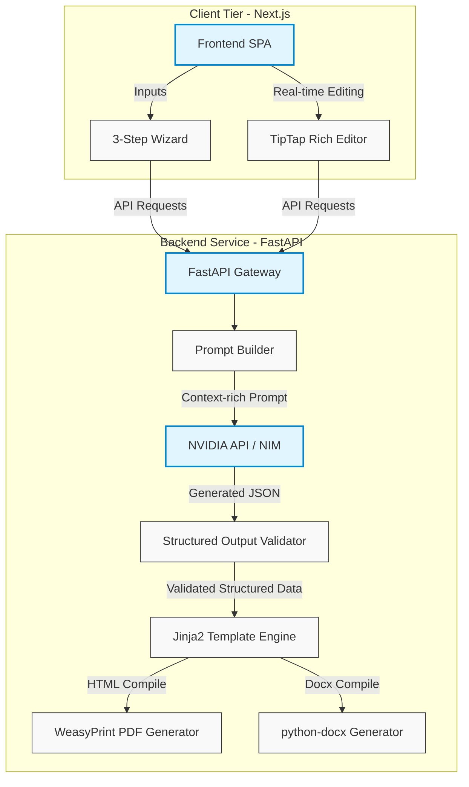

<p align="center">
  <h1 align="center">⚖️ ArzAI — AI-Powered Petition & Legal Document Assistant</h1>
</p>

<p align="center">
  <strong>Template-driven official petition generation platform.</strong>
</p>

<p align="center">
  LLM generates the structured body text, while the official structure, headers, signatures, and layouts are strictly governed by Jinja2 templates to match legal-tech standards.
</p>

<p align="center">
  
  
  
  
  
  
  
</p>

<p align="center">
  <a href="#-overview"><strong>Overview</strong></a> ·
  <a href="#-key-features"><strong>Key Features</strong></a> ·
  <a href="#-architecture"><strong>Architecture</strong></a> ·
  <a href="#-quick-start-docker"><strong>Quick Start (Docker)</strong></a> ·
  <a href="#-local-installation"><strong>Local Setup</strong></a> ·
  <a href="#-environment-variables"><strong>Configuration</strong></a>
</p>

---

## 📖 Overview

**ArzAI** is a legal-tech platform built to automate the creation of formal petitions (dilekçe) for various Turkish state institutions and private organizations. 

Unlike standard LLM generation tools that output arbitrary text styles, **ArzAI** ensures that legal documents adhere strictly to standard bureaucratic templates. It utilizes an LLM to dynamically generate the specific legal body, arguments, and details based on user context, then feeds this structured output into a **Jinja2 engine** to render perfectly formatted PDFs (via WeasyPrint) and Word documents (`.docx`).

---

## ✨ Key Features

*   🏠 **Modern Landing Page (`/`)**: Clean hero section, features list, and direct links to start the document wizard.
*   🧙‍♂️ **Interactive 3-Step Wizard (`/create`)**:
    1.  **Institution Selection**: Auto-complete and filtered list of target state bodies (e.g., CİMER, Universities, Consumer Arbitration Board).
    2.  **Category Selection**: Select petition types (Complaints, Leave Request, Appeal, Reinstatement, etc.).
    3.  **Context Questionnaire**: Interactive, AI-assisted form asking smart questions tailored to the category to retrieve exact legal details.
*   📝 **Legal TipTap Editor (`/editor`)**:
    *   **A4 Preview Layout**: Real-time styling matching physical paper dimensions.
    *   **AI Rewrite Tools**: Refine paragraphs, change tone to formal/legal, or expand/shorten content dynamically.
    *   **Multi-Format Export**: Direct downloads for **PDF** (rendered cleanly using WeasyPrint) and **DOCX** (using python-docx), or physical print command.
*   📊 **Traceability Dashboard (`/dashboard`)**: History log, search, and instant re-editing of past generated petitions.
*   🎨 **Sleek UX/UI**: Styled using Tailwind CSS, Radix UI primitives (`shadcn`), Framer Motion animations, and a polished legal-tech palette (Navy / Indigo).

---

## 🏗️ Architecture



---

## 🚀 Quick Start (Docker)

> [!NOTE]
> Docker and Docker Compose are required. Ensure you copy the environment file and set your key or toggle the mock option before running.

```bash
# 1. Copy environment template
cp .env.example .env

# 2. Run the environment
docker compose up --build
```

### Services Mapping

Once up, the following local services will be available:

| Service | Local URL | Description |
| :--- | :--- | :--- |
| **Frontend** | `http://localhost:3000` | Next.js SPA User Interface |
| **API Backend** | `http://localhost:8000` | FastAPI API Server |
| **Interactive API Docs** | `http://localhost:8000/docs` | Swagger / OpenAPI UI |
| **Prompt Management** | `http://localhost:3000/prompts` | AI Prompt editor & template tuner |

To run the container stack without an active NVIDIA API Key for development:
```bash
LLM_MOCK=true docker compose up --build
```

---

## 🛠️ Local Installation

### Backend Setup

1.  **Clone & Navigate**:
    ```bash
    git clone <your-repository-url>
    cd ArzAI
    ```
2.  **Create Virtual Environment**:
    ```bash
    python -m venv .venv
    source .venv/bin/activate  # On Windows: .venv\Scripts\activate
    ```
3.  **Install Dependencies**:
    ```bash
    pip install -r requirements.txt
    ```
4.  **Configure Environment**:
    ```bash
    cp .env.example .env
    # Edit .env file and set NVIDIA_API_KEY or set LLM_MOCK=true
    ```
5.  **Run FastAPI Server**:
    ```bash
    python main.py
    ```
    *API running at `http://127.0.0.1:8000`*

### Frontend Setup

1.  **Navigate to Frontend Directory**:
    ```bash
    cd frontend
    ```
2.  **Install npm Packages**:
    ```bash
    npm install
    ```
3.  **Run Dev Server**:
    ```bash
    NEXT_PUBLIC_API_URL=http://127.0.0.1:8000 npm run dev
    ```
    *App running at `http://localhost:3000`*

---

## ⚙️ Environment Variables

The application can be configured using a `.env` file at the root directory:

| Variable | Default Value | Description |
| :--- | :--- | :--- |
| `NVIDIA_API_KEY` | `your_nvidia_api_key` | NVIDIA Integrate API key for LLM generations |
| `NVIDIA_API_URL` | `https://integrate.api.nvidia.com/v1` | Base URL for OpenAI-compatible NVIDIA NIM endpoint |
| `NVIDIA_MODEL` | `meta/llama-3.1-8b-instruct` | NVIDIA NIM Model Identifier |
| `DATABASE_URL` | `sqlite+aiosqlite:///./dilekce.db` | SQLAlchemy Async database URL (SQLite/PostgreSQL) |
| `LOG_LEVEL` | `INFO` | Application log verbosity (`DEBUG`, `INFO`, `WARNING`, `ERROR`) |
| `CORS_ORIGINS` | `http://localhost:3000,http://127.0.0.1:3000` | Permitted frontend origins for API communication |
| `LLM_MOCK` | `false` | When `true`, runs the server in mock mode (bypasses NVIDIA API) |

---

## 📂 Supported Petition Categories (MVP)

*   🏛️ **CİMER (Presidential Communication Center)**: Formal complaints, official requests, and citizen feedback.
*   🎓 **University Administration**: Academic leave applications, exam result objections, course registration appeals.
*   🛍️ **Consumer Arbitration Board (Tüketici Hakem Heyeti)**: Official refund/replacement disputes, merchant complaints.
*   💼 **Labor & Employment Law**: Formal reinstatement notifications, resignation/leave demands.

---

## 🧪 Testing

The repository includes a comprehensive test suite covering the endpoints and templating logic.

To execute tests with a Mock LLM interface:
```bash
LLM_MOCK=true pytest -q
```
